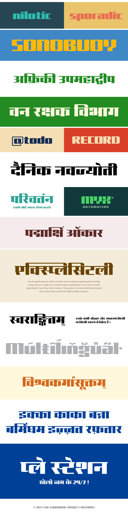

# Gajraj One

[![][Fontbakery]](https://xconsau.github.io/GajrajOne/fontbakery/fontbakery-report.html)
[![][Universal]](https://xconsau.github.io/GajrajOne/fontbakery/fontbakery-report.html)
[![][GF Profile]](https://xconsau.github.io/GajrajOne/fontbakery/fontbakery-report.html)
[![][Outline Correctness]](https://xconsau.github.io/GajrajOne/fontbakery/fontbakery-report.html)
[![][Shaping]](https://xconsau.github.io/GajrajOne/fontbakery/fontbakery-report.html)

[Fontbakery]: https://img.shields.io/endpoint?url=https%3A%2F%2Fraw.githubusercontent.com%2Fxconsau%2FGajrajOne%2Fgh-pages%2Fbadges%2Foverall.json
[GF Profile]: https://img.shields.io/endpoint?url=https%3A%2F%2Fraw.githubusercontent.com%2Fxconsau%2FGajrajOne%2Fgh-pages%2Fbadges%2FGoogleFonts.json
[Outline Correctness]: https://img.shields.io/endpoint?url=https%3A%2F%2Fraw.githubusercontent.com%2Fxconsau%2FGajrajOne%2Fgh-pages%2Fbadges%2FOutlineCorrectnessChecks.json
[Shaping]: https://img.shields.io/endpoint?url=https%3A%2F%2Fraw.githubusercontent.com%2Fxconsau%2FGajrajOne%2Fgh-pages%2Fbadges%2FShapingChecks.json
[Universal]: https://img.shields.io/endpoint?url=https%3A%2F%2Fraw.githubusercontent.com%2Fxconsau%2FGajrajOne%2Fgh-pages%2Fbadges%2FUniversal.json

Gajraj (meaning, the King of Elephants) is a Latin display typeface with Devanagari language support. The design is envisioned for large hoardings, signage and print collaterals for branding & advertisements. Being one of my first attempts on the Devanagari script, the font is released as a single variant display typeface.

The OpenType features and naming conventions are adapted from the works of [EkType](https://github.com/ektype) foundry's Devanagari typefaces like Baloo and Mukta. Taking a step further, I have tried to implement a "Repeating pattern bridge" technique for (almost) unlimited small-ikar matra variants. This technique uses a left arm, a right arm, and intermediate repeating horizontal blocks to form a complete matra of desired width. The technique requires only a few glyphs, and is largely controlled by the OpenType rules. The purpose is to save some file size here. I have also developed a small php program for generating these matra rules. (More details to come separately on this technique).

## About

Saurabh Sharma is an independent Graphic/Web design professional.

## Building

Fonts are built automatically by GitHub Actions - take a look in the "Actions" tab for the latest build.

If you want to build fonts manually on your own computer:

* `make build` will produce font files.
* `make test` will run [FontBakery](https://github.com/googlefonts/fontbakery)'s quality assurance tests.
* `make proof` will generate HTML proof files.

The proof files and QA tests are also available automatically via GitHub Actions - look at https://xconsau.github.io/GajrajOne.

## Changelog

**31 Aug 2022. Version 1.0**
- Initial Release

## License

This Font Software is licensed under the SIL Open Font License, Version 1.1.
This license is available with a FAQ at
https://scripts.sil.org/OFL

## Repository Layout

This font repository structure is inspired by [Unified Font Repository v0.3](https://github.com/unified-font-repository/Unified-Font-Repository), modified for the Google Fonts workflow.
